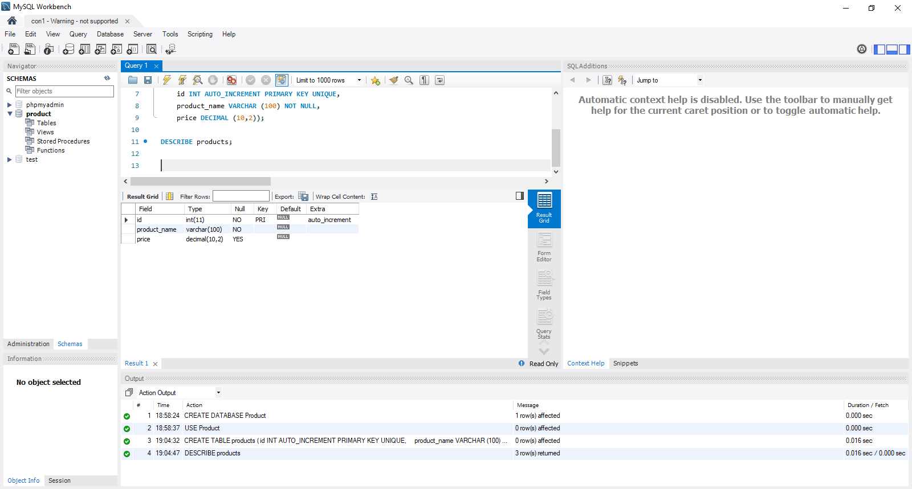
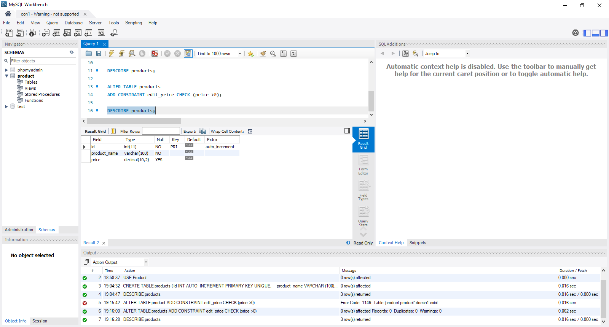
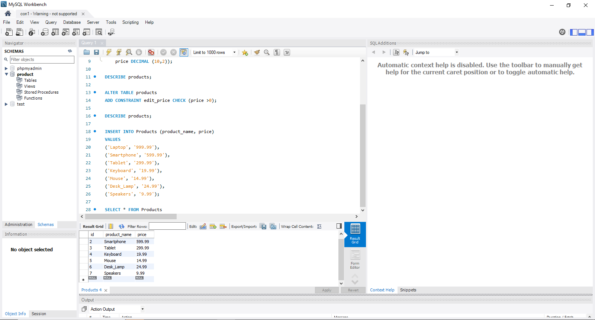
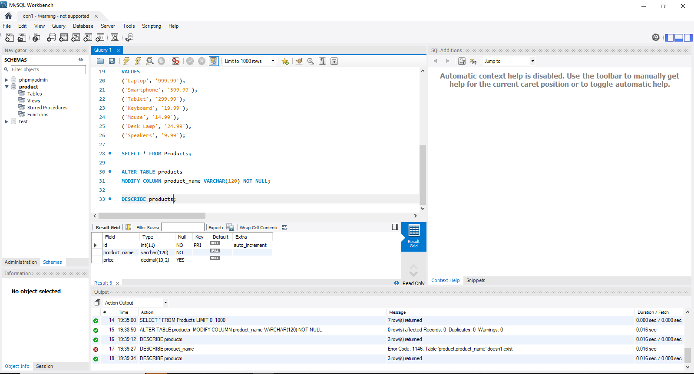
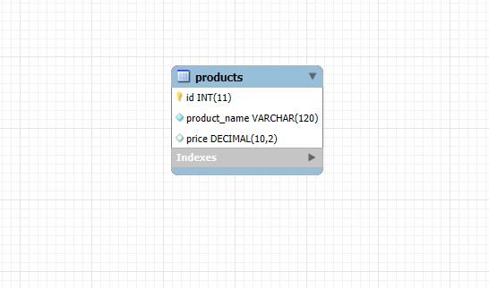

# Finals Lab Task 3 - Table Manipulation
In this lab activity, I used SQL ALTER statements to manipulate existing tables in a database. The tasks involved modifying the structure of the Student, Assignment, and Submission tables by adding new columns, changing data types, and applying constraints. This task helped me understand how to manage and update table structures efficiently.

Here are the steps I followed:
- Opened the existing database
  - Used USE to select the database I worked on from Lab Task 2.
- Performed table modifications
  - Added new columns using ALTER TABLE ADD, such as additional fields like grade or remarks.
  - Modified data types of existing columns using MODIFY COLUMN.
  - Set constraints like NOT NULL or DEFAULT to ensure data integrity.
- Checked the table structure
  - Used DESCRIBE to review changes in the structure after each task.
  - Ensured all updates were successfully applied.
- Exported the updated ER Diagram
  - Used phpMyAdmin or MySQL Workbench to generate the new ER Diagram or relational schema after the changes.
## Here's the screenshot of my output for Task 1(See screenshot)

## Here's the screenshot of my output for Task 2 (See screenshot)

## Here's the screenshot of my output for the Task 3 (See screenshot)

## Here's the screenshot of my output for the Task 4 (See screenshot)

## Here's the screenshot of my output for the ER Diagram/Relational Schema (See screenshot)

